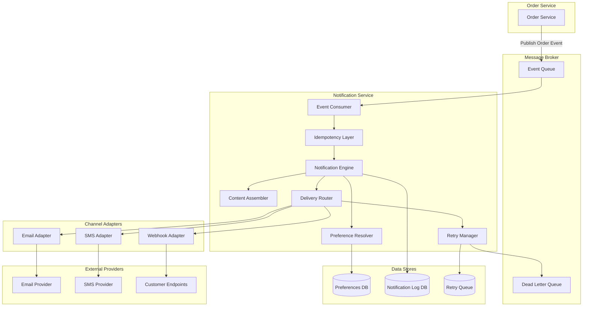
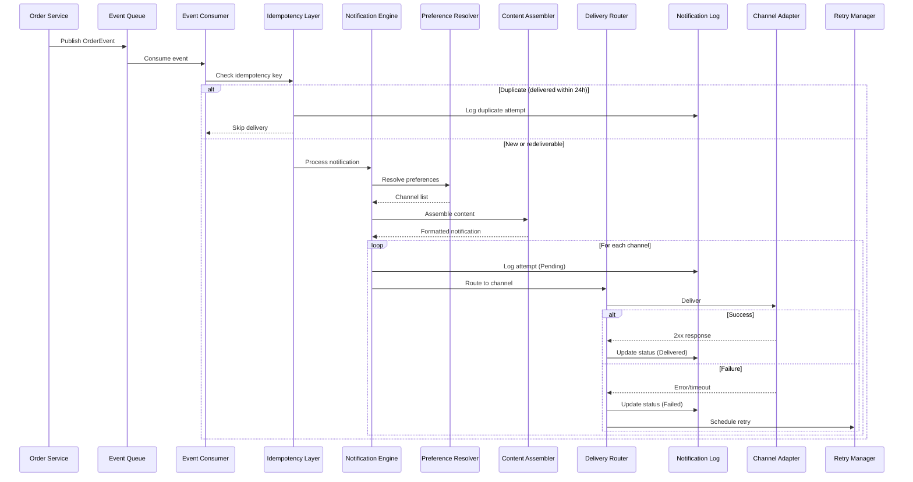
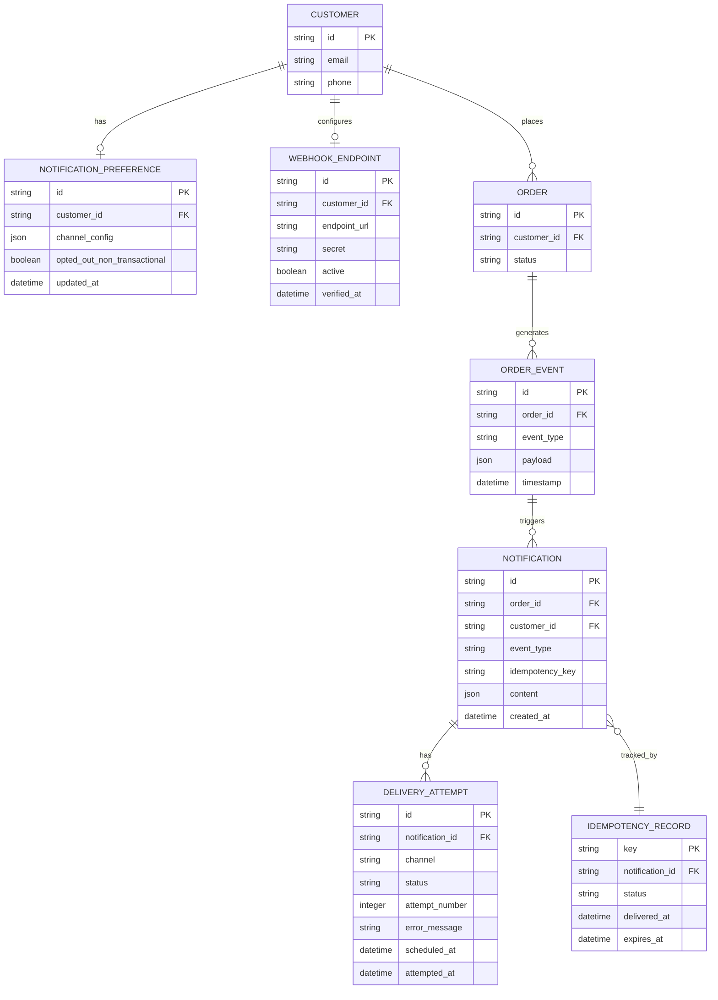
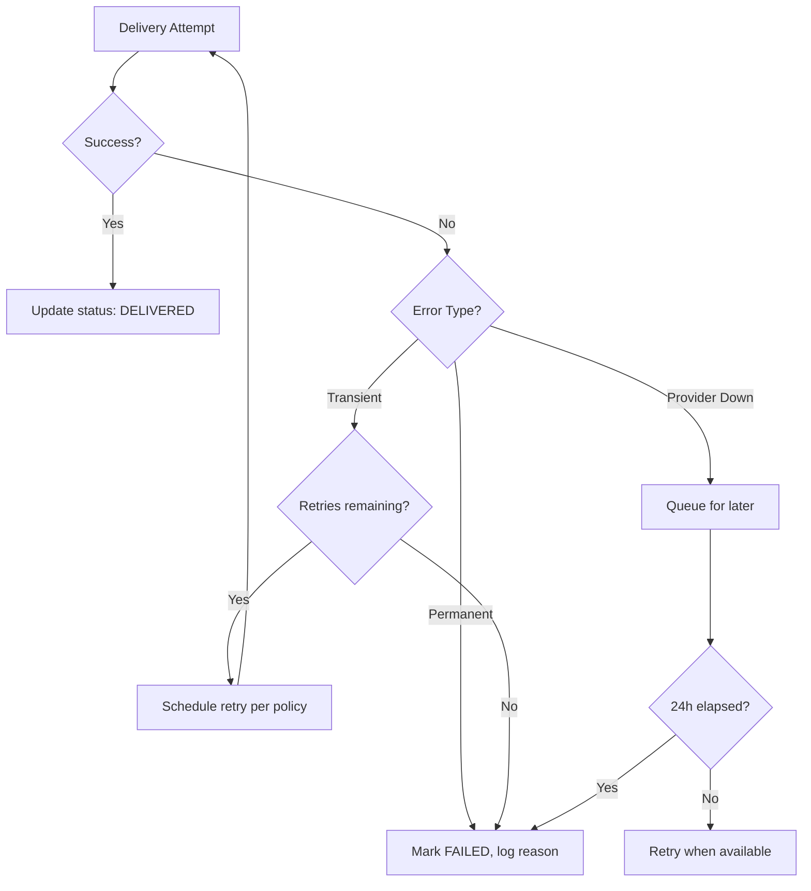

# Design Document: Order Notifications

## Overview

The Order Notifications system is an event-driven service that listens to order lifecycle events and delivers timely, customer-configurable notifications through multiple channels (Email, SMS, Webhook). The system emphasizes reliability through retry mechanisms, idempotent delivery, and comprehensive logging for support visibility.

**Key Design Decisions:**

1. **Event-driven architecture** — Order events are published to a message queue, decoupling the order service from notification logic. This ensures order state transitions are never blocked by notification processing.
2. **Channel-agnostic routing** — A unified notification pipeline resolves customer preferences and fans out delivery to channel-specific adapters, making it straightforward to add new channels in the future.
3. **Write-ahead logging** — Every delivery attempt is logged before execution, ensuring auditability even if delivery fails or the service crashes mid-operation.
4. **Idempotency by design** — Deterministic idempotency keys prevent duplicate notifications at the application level, regardless of upstream retry behavior.

## Architecture

### High-Level System Diagram



### Notification Lifecycle Sequence



## Components and Interfaces

### 1. Event Consumer

Consumes order events from the message queue and dispatches them to the Notification Engine.

```typescript
interface OrderEvent {
  eventId: string;
  eventType: OrderEventType;
  orderId: string;
  customerId: string;
  timestamp: Date;
  payload: OrderEventPayload;
}

enum OrderEventType {
  ORDER_PLACED = 'ORDER_PLACED',
  ORDER_SHIPPED = 'ORDER_SHIPPED',
  DELIVERY_ESTIMATE_UPDATED = 'DELIVERY_ESTIMATE_UPDATED',
  ORDER_DELIVERED = 'ORDER_DELIVERED',
  ORDER_CANCELLED = 'ORDER_CANCELLED',
}

interface EventConsumer {
  /** Subscribe to order events from the message queue */
  subscribe(): void;

  /** Handle an incoming order event */
  handleEvent(event: OrderEvent): Promise<void>;
}
```

### 2. Idempotency Layer

Generates deterministic idempotency keys and enforces duplicate prevention.

```typescript
interface IdempotencyLayer {
  /**
   * Generate a deterministic idempotency key from event type and order ID.
   * Key format: `${eventType}:${orderId}`
   */
  generateKey(eventType: OrderEventType, orderId: string): string;

  /**
   * Check if a notification with this key can be delivered.
   * Returns true if: no prior delivery, prior delivery failed, or prior status unknown.
   * Returns false if: successfully delivered within last 24 hours.
   */
  canDeliver(key: string): Promise<boolean>;

  /** Record a successful delivery for the given key */
  recordDelivery(key: string, timestamp: Date): Promise<void>;

  /** Log a skipped duplicate attempt */
  logDuplicateAttempt(key: string, originalTimestamp: Date): Promise<void>;
}
```

### 3. Preference Resolver

Resolves which channels a notification should be delivered to based on customer preferences.

```typescript
interface NotificationPreference {
  customerId: string;
  channels: ChannelPreference[];
  optedOutOfNonTransactional: boolean;
}

interface ChannelPreference {
  channel: DeliveryChannel;
  enabledEvents: OrderEventType[];
  active: boolean;
}

enum DeliveryChannel {
  EMAIL = 'EMAIL',
  SMS = 'SMS',
  WEBHOOK = 'WEBHOOK',
}

interface PreferenceResolver {
  /**
   * Resolve delivery channels for a given customer and event type.
   * Rules:
   * - Transactional events (ORDER_PLACED, ORDER_CANCELLED) always deliver
   * - Non-transactional events respect customer opt-out
   * - Default to EMAIL if no preference configured
   * - At least one channel must remain for transactional events
   */
  resolveChannels(
    customerId: string,
    eventType: OrderEventType
  ): Promise<DeliveryChannel[]>;

  /** Get customer's full preference configuration */
  getPreference(customerId: string): Promise<NotificationPreference | null>;

  /** Update customer preference with validation */
  updatePreference(
    customerId: string,
    preference: NotificationPreference
  ): Promise<UpdateResult>;
}

interface UpdateResult {
  success: boolean;
  errorMessage?: string;
}

/** Classification of event types */
const TRANSACTIONAL_EVENTS: OrderEventType[] = [
  OrderEventType.ORDER_PLACED,
  OrderEventType.ORDER_CANCELLED,
];

const NON_TRANSACTIONAL_EVENTS: OrderEventType[] = [
  OrderEventType.ORDER_SHIPPED,
  OrderEventType.DELIVERY_ESTIMATE_UPDATED,
  OrderEventType.ORDER_DELIVERED,
];
```

### 4. Content Assembler

Assembles notification content based on event type and payload.

```typescript
interface NotificationContent {
  subject: string;
  body: string;
  metadata: Record<string, unknown>;
}

interface OrderPlacedPayload {
  orderId: string;
  orderTotal: number;
  items: OrderItem[];
}

interface OrderItem {
  itemName: string;
  quantity: number;
  unitPrice: number;
}

interface OrderShippedPayload {
  orderId: string;
  carrierName: string | null;
  trackingNumber: string | null;
}

interface DeliveryEstimatePayload {
  orderId: string;
  carrierName: string;
  trackingNumber: string;
  estimatedDeliveryDate: Date;
}

interface OrderDeliveredPayload {
  orderId: string;
  deliveryTimestamp: Date;
}

interface OrderCancelledPayload {
  orderId: string;
  cancellationReason: string;
  refundAmount: number | null;
  estimatedRefundProcessingTime: string | null;
}

type OrderEventPayload =
  | OrderPlacedPayload
  | OrderShippedPayload
  | DeliveryEstimatePayload
  | OrderDeliveredPayload
  | OrderCancelledPayload;

interface ContentAssembler {
  /**
   * Assemble notification content for a given event.
   * Ensures all required fields for the event type are included.
   */
  assemble(eventType: OrderEventType, payload: OrderEventPayload): NotificationContent;
}
```

### 5. Delivery Router

Routes assembled notifications to appropriate channel adapters.

```typescript
interface DeliveryResult {
  channel: DeliveryChannel;
  status: DeliveryStatus;
  attemptTimestamp: Date;
  errorMessage?: string;
}

enum DeliveryStatus {
  PENDING = 'PENDING',
  SENT = 'SENT',
  DELIVERED = 'DELIVERED',
  FAILED = 'FAILED',
}

interface DeliveryRouter {
  /**
   * Deliver notification to specified channels.
   * Channels are independent — failure in one does not block others.
   */
  deliver(
    notification: NotificationContent,
    channels: DeliveryChannel[],
    customerId: string
  ): Promise<DeliveryResult[]>;
}
```

### 6. Channel Adapters

```typescript
interface ChannelAdapter {
  /** Send notification content to the customer through this channel */
  send(
    customerId: string,
    content: NotificationContent
  ): Promise<ChannelDeliveryResult>;
}

interface ChannelDeliveryResult {
  success: boolean;
  statusCode?: number;
  errorMessage?: string;
}

interface WebhookAdapter extends ChannelAdapter {
  /**
   * Validate a webhook endpoint by sending a verification request.
   * Endpoint is active only if 2xx response within 5 seconds.
   */
  verifyEndpoint(endpointUrl: string): Promise<VerificationResult>;

  /**
   * Sign the payload with HMAC-SHA256 using the customer's webhook secret.
   * Returns the signature to include as a header.
   */
  signPayload(payload: string, secret: string): string;
}

interface VerificationResult {
  verified: boolean;
  errorMessage?: string;
}
```

### 7. Retry Manager

Manages retry scheduling with exponential backoff.

```typescript
interface RetryPolicy {
  maxAttempts: number;
  intervals: number[]; // milliseconds between attempts
}

/** Standard retry: 3 attempts at 1min, 5min, 15min */
const STANDARD_RETRY_POLICY: RetryPolicy = {
  maxAttempts: 3,
  intervals: [60_000, 300_000, 900_000],
};

/** Webhook retry: 5 attempts with exponential backoff starting at 30s */
const WEBHOOK_RETRY_POLICY: RetryPolicy = {
  maxAttempts: 5,
  intervals: [30_000, 60_000, 120_000, 240_000, 480_000],
};

interface RetryManager {
  /**
   * Schedule a retry for a failed delivery attempt.
   * Returns the scheduled retry time.
   */
  scheduleRetry(
    notificationId: string,
    channel: DeliveryChannel,
    attemptNumber: number,
    policy: RetryPolicy
  ): Promise<Date | null>; // null if max attempts exhausted

  /**
   * Process pending retries that are due.
   */
  processRetries(): Promise<void>;

  /**
   * Mark a notification as permanently failed after all retries exhausted.
   */
  markPermanentlyFailed(
    notificationId: string,
    channel: DeliveryChannel,
    reason: string
  ): Promise<void>;
}
```

### 8. Notification Log

Provides audit trail and support query capabilities.

```typescript
interface NotificationLogEntry {
  id: string;
  notificationId: string;
  orderId: string;
  customerId: string;
  eventType: OrderEventType;
  channel: DeliveryChannel;
  status: DeliveryStatus;
  contentSummary: string;
  timestamp: Date;
  attemptNumber: number;
  errorMessage?: string;
  idempotencyKey: string;
}

interface PaginatedResult<T> {
  entries: T[];
  totalCount: number;
  page: number;
  pageSize: number;
  hasNextPage: boolean;
  nextPageToken?: string;
}

interface NotificationLog {
  /** Persist a delivery attempt (write-ahead, before actual delivery) */
  logAttempt(entry: NotificationLogEntry): Promise<void>;

  /** Update the delivery status of an existing log entry */
  updateStatus(entryId: string, status: DeliveryStatus, errorMessage?: string): Promise<void>;

  /**
   * Query notification history by order ID.
   * Returns paginated results sorted by timestamp descending.
   * Max 50 entries per page.
   * Returns empty result set (not error) for non-existent orders.
   */
  queryByOrder(
    orderId: string,
    page: number,
    pageSize?: number // default 50, max 50
  ): Promise<PaginatedResult<NotificationLogEntry>>;

  /** Log a skipped duplicate delivery attempt */
  logDuplicate(
    idempotencyKey: string,
    originalDeliveryTimestamp: Date
  ): Promise<void>;
}
```

### 9. Webhook Endpoint Manager

```typescript
interface WebhookEndpoint {
  customerId: string;
  endpointUrl: string;
  secret: string; // shared secret for HMAC signing
  active: boolean;
  verifiedAt?: Date;
}

interface WebhookEndpointManager {
  /**
   * Register and verify a webhook endpoint.
   * Sends verification request; activates only on 2xx within 5s.
   */
  registerEndpoint(
    customerId: string,
    endpointUrl: string
  ): Promise<{ success: boolean; errorMessage?: string }>;

  /** Get active endpoint for a customer */
  getActiveEndpoint(customerId: string): Promise<WebhookEndpoint | null>;

  /** Deactivate an endpoint */
  deactivateEndpoint(customerId: string): Promise<void>;
}
```

### 10. Shipping Deferral Handler

Handles the special case where shipping notifications may be deferred.

```typescript
interface ShippingDeferralHandler {
  /**
   * Handle a shipped event that may have missing carrier/tracking info.
   * Defers notification until both are available or 10 minutes elapse.
   */
  handleShippedEvent(event: OrderEvent): Promise<void>;

  /** Check deferred notifications and release those that are ready */
  processDeferredNotifications(): Promise<void>;
}
```

## Data Models

### Entity Relationship Diagram



### Key Data Structures

```typescript
// Database schema for notification preferences
interface NotificationPreferenceRecord {
  id: string;
  customerId: string;
  channelConfig: {
    [channel in DeliveryChannel]?: {
      active: boolean;
      enabledEvents: OrderEventType[];
    };
  };
  optedOutOfNonTransactional: boolean;
  updatedAt: Date;
  createdAt: Date;
}

// Database schema for notification log
interface NotificationRecord {
  id: string;
  orderId: string;
  customerId: string;
  eventType: OrderEventType;
  idempotencyKey: string;
  content: NotificationContent;
  createdAt: Date;
}

// Database schema for delivery attempts
interface DeliveryAttemptRecord {
  id: string;
  notificationId: string;
  channel: DeliveryChannel;
  status: DeliveryStatus;
  attemptNumber: number;
  errorMessage: string | null;
  scheduledAt: Date;
  attemptedAt: Date | null;
  completedAt: Date | null;
}

// Database schema for idempotency tracking
interface IdempotencyRecord {
  key: string; // format: `${eventType}:${orderId}`
  notificationId: string;
  status: 'delivered' | 'failed' | 'unknown';
  deliveredAt: Date | null;
  expiresAt: Date; // 24 hours from delivery
}

// Deferred shipping notification
interface DeferredShippingRecord {
  orderId: string;
  eventId: string;
  deferredAt: Date;
  expiresAt: Date; // deferredAt + 10 minutes
  carrierName: string | null;
  trackingNumber: string | null;
  resolved: boolean;
}
```

## Correctness Properties

*A property is a characteristic or behavior that should hold true across all valid executions of a system — essentially, a formal statement about what the system should do. Properties serve as the bridge between human-readable specifications and machine-verifiable correctness guarantees.*

### Property 1: Notification content completeness

*For any* order event of a given type and its associated payload, the Content Assembler SHALL produce notification content that includes every field required by that event type's specification (e.g., order ID + total + items for ORDER_PLACED; order ID + carrier + tracking for ORDER_SHIPPED; order ID + reason + refund amount for ORDER_CANCELLED with refund).

**Validates: Requirements 1.2, 2.2, 2.4, 3.2, 4.2, 4.3**

### Property 2: Channel routing correctness

*For any* customer and order event type, the Preference Resolver SHALL return delivery channels that exactly match the customer's active configured channels for that event type, defaulting to EMAIL when no preference is configured.

**Validates: Requirements 1.3, 1.5, 4.4, 5.3, 5.4, 6.6**

### Property 3: Standard retry policy compliance

*For any* failed email or SMS delivery attempt, the Retry Manager SHALL schedule at most 3 retries with intervals of 1 minute, 5 minutes, and 15 minutes respectively, and SHALL not schedule further retries after the third attempt.

**Validates: Requirements 1.4, 3.3, 4.5, 8.1**

### Property 4: Webhook retry policy compliance

*For any* failed webhook delivery attempt, the Retry Manager SHALL schedule at most 5 retries using exponential backoff starting at 30 seconds, and SHALL mark delivery as permanently failed after the fifth consecutive failure.

**Validates: Requirements 7.4, 7.5**

### Property 5: Channel independence

*For any* notification delivered to multiple channels, a failure in one channel's delivery SHALL NOT prevent or delay delivery attempts to other configured channels, and each channel's failure status SHALL be recorded independently.

**Validates: Requirements 5.5**

### Property 6: Preference update propagation

*For any* customer preference update, all notifications generated after the update SHALL be routed according to the new preference configuration, and bulk opt-out of non-transactional events SHALL prevent delivery of ORDER_SHIPPED, DELIVERY_ESTIMATE_UPDATED, and ORDER_DELIVERED notifications.

**Validates: Requirements 6.1, 6.2, 6.3**

### Property 7: Transactional notification override

*For any* customer preference configuration (including full opt-out), ORDER_PLACED and ORDER_CANCELLED notifications SHALL always be delivered through at least one channel, and any attempt to disable all channels for these transactional event types SHALL be rejected.

**Validates: Requirements 6.4, 6.5**

### Property 8: Webhook endpoint verification

*For any* webhook endpoint registration attempt, the endpoint SHALL be marked as active if and only if it responds with a 2xx HTTP status code within 5 seconds; all other responses (non-2xx, timeout, network error) SHALL result in rejection with an appropriate error message.

**Validates: Requirements 7.1, 7.2**

### Property 9: Webhook payload integrity

*For any* webhook delivery, the HTTP POST payload SHALL contain valid JSON with the complete Order_Event data, and SHALL include an HMAC-SHA256 signature header computed from the payload and the customer's shared secret such that the receiver can verify authenticity (sign-then-verify round-trip).

**Validates: Requirements 7.3, 7.6**

### Property 10: Write-ahead delivery logging

*For any* delivery attempt, a log entry with PENDING status SHALL exist in the Notification_Log before the actual delivery call is made, and upon completion the status SHALL be updated to reflect the delivery outcome (DELIVERED or FAILED with reason).

**Validates: Requirements 8.2, 8.3, 8.5**

### Property 11: Notification log query correctness

*For any* order identifier query to the Notification_Log, the results SHALL contain only notifications for that specific order, SHALL include timestamp, channel, status, and content summary for each entry, SHALL be sorted by timestamp in descending order, and SHALL contain at most 50 entries per page with pagination to access remaining entries.

**Validates: Requirements 9.1, 9.2, 9.4**

### Property 12: Idempotency key determinism

*For any* pair of (OrderEventType, orderId), the generated idempotency key SHALL be deterministic (same inputs always produce same key), and distinct pairs SHALL produce distinct keys.

**Validates: Requirements 10.1**

### Property 13: Duplicate prevention

*For any* notification delivery attempt, delivery SHALL be skipped if and only if a notification with the same idempotency key was successfully delivered within the previous 24 hours; failed or unknown delivery status SHALL always permit redelivery.

**Validates: Requirements 10.2, 10.3, 10.4**

## Error Handling

### Error Categories and Strategies

| Error Category | Examples | Strategy |
|---|---|---|
| Transient provider failure | Email/SMS API timeout, 5xx response | Retry with exponential backoff per retry policy |
| Permanent provider failure | Invalid recipient, 4xx response | Mark failed, log reason, no retry |
| Provider unavailability | Provider completely down | Queue notification, retry within 24h window |
| Webhook delivery failure | Non-2xx response, timeout >10s | Retry with webhook-specific policy (5 attempts) |
| Preference validation error | All transactional channels disabled | Reject with descriptive error message |
| Webhook verification failure | Non-2xx or timeout >5s | Reject endpoint, return error |
| Duplicate notification | Same idempotency key, delivered <24h | Skip delivery, log duplicate attempt |
| Missing shipping data | Carrier/tracking not available | Defer up to 10 minutes, then send with available data |
| Queue overflow / 24h timeout | Queued notification exceeds 24h | Mark permanently failed, record timeout reason |

### Error Handling Flow



### Circuit Breaker Pattern

For each delivery channel provider, implement a circuit breaker:
- **Closed**: Normal operation, requests flow through
- **Open**: Provider is down, requests are queued immediately (trips after 5 consecutive failures within 1 minute)
- **Half-Open**: After 30 seconds, allow one test request through to check recovery

### Dead Letter Queue

Notifications that permanently fail after all retries are moved to a Dead Letter Queue for:
- Manual inspection by support/operations staff
- Potential manual reprocessing
- Alerting and monitoring

## Testing Strategy

### Dual Testing Approach

This feature benefits from both property-based testing and example-based testing. The notification system contains substantial pure business logic (content assembly, preference resolution, idempotency checks, retry scheduling) that is well-suited to property-based testing, while integration points with external providers require example-based integration tests.

### Property-Based Testing

**Library:** fast-check (TypeScript)

**Configuration:**
- Minimum 100 iterations per property test
- Each test tagged with: `Feature: order-notifications, Property {N}: {property_text}`

**Properties to implement:**

| Property | Target Component | Generator Strategy |
|---|---|---|
| 1: Content completeness | ContentAssembler | Random OrderEventPayloads per event type |
| 2: Channel routing | PreferenceResolver | Random preference configurations + event types |
| 3: Standard retry policy | RetryManager | Random failure sequences with attempt counts |
| 4: Webhook retry policy | RetryManager | Random webhook failure sequences |
| 5: Channel independence | DeliveryRouter | Multi-channel delivery with random failure patterns |
| 6: Preference propagation | PreferenceResolver + NotificationEngine | Random preference updates + subsequent events |
| 7: Transactional override | PreferenceResolver | Random configs including all-disabled scenarios |
| 8: Webhook verification | WebhookAdapter | Random HTTP responses (2xx, non-2xx, timeouts) |
| 9: Webhook payload integrity | WebhookAdapter | Random payloads, sign-then-verify round trip |
| 10: Write-ahead logging | NotificationLog | Random delivery sequences |
| 11: Log query correctness | NotificationLog | Random log entries, verify filter + sort + pagination |
| 12: Idempotency key determinism | IdempotencyLayer | Random (eventType, orderId) pairs |
| 13: Duplicate prevention | IdempotencyLayer | Random delivery histories with varying statuses |

### Unit Tests (Example-Based)

- Shipping deferral: carrier/tracking available immediately, one missing then arrives, 10-minute timeout
- Non-existent order query returns empty result (not error)
- Customer with no configured channel: notification logged, not sent
- Cancellation with refund includes refund details; without refund omits them
- Preference update confirmation response structure

### Integration Tests

- End-to-end notification delivery timing (within 30s/60s SLAs)
- Provider unavailability queueing and recovery
- Message queue consumption and event deserialization
- Database retention policy (90-day minimum)
- Actual email/SMS provider delivery (staging environment)

### Test Environment

- Mock channel adapters for property and unit tests (no real provider calls)
- In-memory database for notification log in test mode
- Testcontainers for integration tests with real database
- Stub HTTP server for webhook endpoint verification and delivery tests
